## TITLE
"Body": using your self as a search tool

## BLURB
We don't count any data scientists in our team (yet) but this 
project earned us some valuable experience applying Machine Learning tools in creative applications.

## BODY TEXT
### What's the deal with AI?
Artifical Intelligence (AI) technologies get thoroughly hyped (perhaps justifiably) in the media. What is less readily understood - at least by the general public - is that a lot of the recent progress has been less about general-purpose intelligence (machines that can truly "think", whatever that means) and more about a much more narrowly-defined field known as [Machine Learning](https://en.wikipedia.org/wiki/Machine_learning). The heart of machine learning is using mathematical models to allow computers to "see" patterns without being explicitly told how to do so, typically by training these models on huge datasets.

This technology has all kinds of applications, from [enabling self-driving cars](https://towardsdatascience.com/how-do-self-driving-cars-see-13054aee2503) to ["deep" faking videos of politicians](https://www.theguardian.com/technology/2019/jun/23/what-do-we-do-about-deepfake-video-ai-facebook) to [discovering new planets](https://ai.google/research/pubs/pub46789).

But we just wanted to use it to make something fun. For kids.

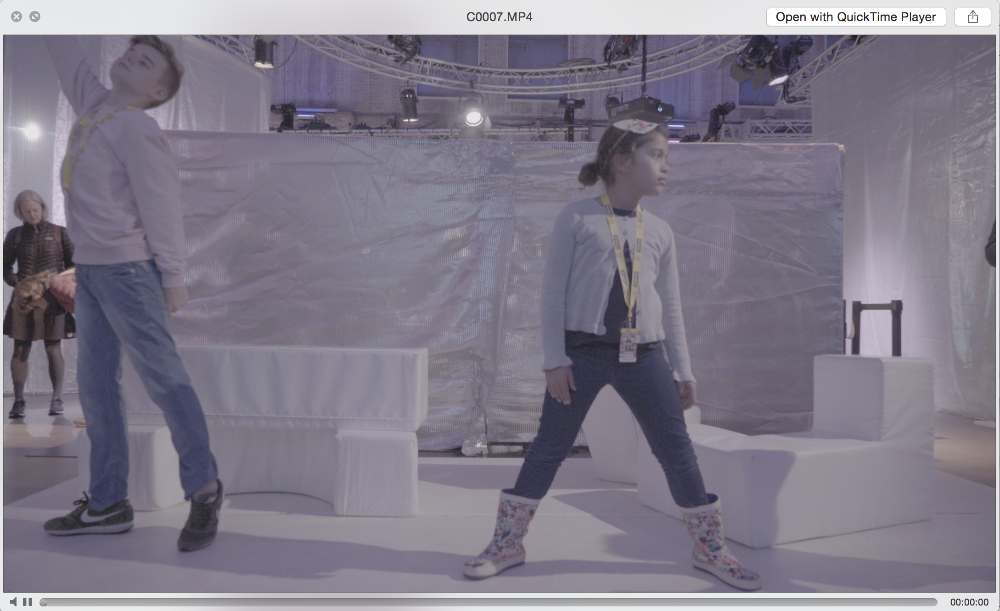


### The concept
We created an installation for [CineKid](https://www.cinekid.nl/), an annual festival in Amsterdam that introduces children to media and media technologies.

We won a "Golden Lion" (not the one from Cannes, sorry) for the best project at the festival. Read some good press [here](https://www.cinekid.nl/nl/nieuws/94) (in Dutch) and on the design site [It's Nice That](https://www.itsnicethat.com/articles/random-studio-body-image-search-digital-151118) (in English).

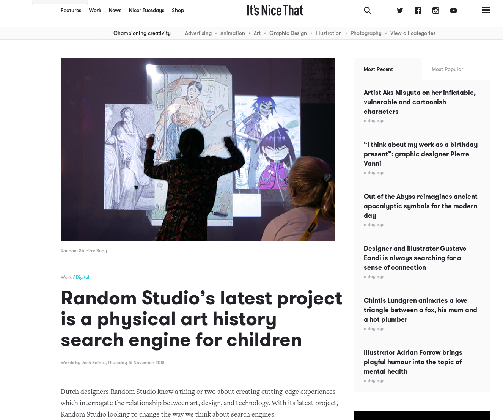

"Body" was about allowing kids to interact with something similar to a search engine, but using their own bodies as the interface, rather than a keyboard.

### The technology challenge

Our team had a very particular set of limitations (some of them self-imposed) which translated into some very interesting technical challenges for this project:

* effectively make use of a relatively large (for us) dataset of **hundreds of thousands of images**
* matching poses from a camera to poses from the image dataset using Machine Learning tools, **but only using web-based technologies**
* achieve a **realtime, multi-user interactive experience** that matched poses of kids in front of the screen to poses in our dataset - as close to instantaneously as possible

It's important to note that none of our team members are data scientists; nor had any of us had significant experience applying "AI" or Machine Learning technologies in our daily work. As a team of creatives, designers, creative technologists and developers, some aspects of this project seemed familiar - graphics, projection, tracking people with sensors - but normally we don't need to deal with huge datasets or esoteric mathematics. This was new territory for us.

In our early research, one of the strongest alternatives to web technologies that we considered was [OpenPose](https://github.com/CMU-Perceptual-Computing-Lab/openpose), which provides really high performance realtime pose estimation using C++ and [CUDA](https://developer.nvidia.com/cuda-zone) (Nvidia General-Purpose GPU processing). However, while it's "free for non-commercial use", there is a substantial "royalty" fee (USD $25,000 per year!) in order to use it on commercial projects.

But apart from the cost to use it (legitimately), we were genuinely interested in seeing how far we could go with web-only technologies. Could we get at least reasonable performance, and reasonable accuracy?

We set our limit to tracking 5 people simultaneously (adequate for the amount of space we had) which ended up giving us a reasonable framerate (around 10 detections per second) on a powerful GPU (Nvidia GTX 1080).

With a "native" solution like OpenPose we could probably have tracked 20 or more people at 30fps, using the exact same hardware. The downside, for us, would have been much slower development time: we only had one C++ programmer on the team, and other aspects of the system would have been much more difficult (for us) to integrate.

Some of the key features of our installation had been demonstrated in a Google project called [Move Mirror](https://experiments.withgoogle.com/move-mirror), with a few key differences: we wanted to **track multiple people simultaneously**, and the output would be **large-format** (a projection surface) with "life size" mirror imagery **tracking your position** in space. We also wanted to see if we could push past the 80,000 image dataset used in this example (we eventually processed about **150,000 images**, and got about 160,000 matchable poses out of these). Finally, we would draw human poses out of **images with multiple people**, not rely on images that only contained a single pose (so we would need to crop and re-centre later).

The Move Mirror team had not released any source code but had written a very informative [blog post](https://medium.com/tensorflow/move-mirror-an-ai-experiment-with-pose-estimation-in-the-browser-using-tensorflow-js-2f7b769f9b23) about their process. We adopted some of the same key technologies, namely:

1. [PoseNet](https://github.com/tensorflow/tfjs-models/tree/master/posenet) - a pretrained model for pose detection that can run in the browser
1. [TensorFlow.js](https://www.tensorflow.org/js) - a library for training and/or applying Machine Learning models in JavaScript.
1. [VPTreeJS](https://github.com/fpirsch/vptree.js/tree/master) - a Javascript implementation of the Vantage-Point Tree "nearest neighbour" search algorithm. We forked [our own version on Random Studio's GitHub](https://github.com/RandomStudio/vptree.js?organization=RandomStudio&organization=RandomStudio) which allowed for generating proper JSON output.

### TensorFlow
TensorFlow is a free and open source library originally developed by Google. Its main application is in Machine Learning.

Tensorflow JS cleverly uses the browser's own hardware-accelerated graphics API - WebGL - in order to leverage the GPU when doing its work: see [this article](https://www.tensorflow.org/js/guide/platform_environment) for more detail.

Therefore, to get more performance when running "live", we simply used the biggest graphics card we had - in this case, the [NVIDIA GTX 1080](https://www.nvidia.com/en-us/geforce/products/10series/geforce-gtx-1080/).

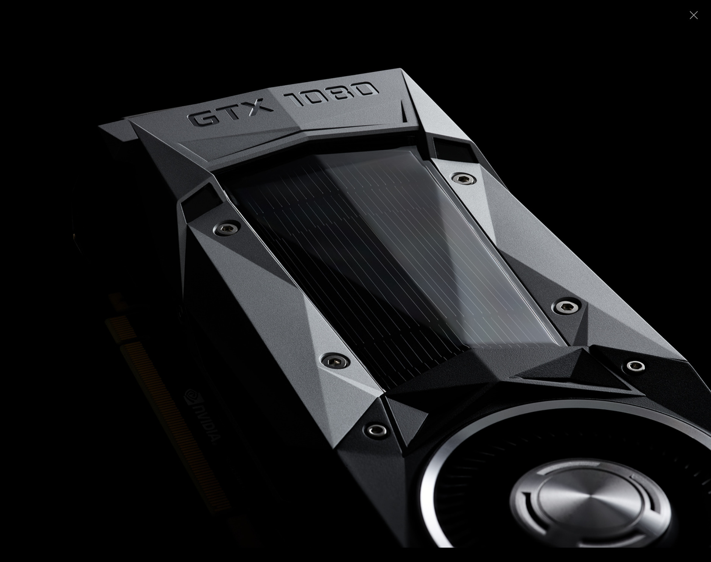

### VP What?
A Vantage Point Tree (VP Tree) is a very clever way of taking a bunch of "points" (these could represent anything, e.g. 150K body poses in our case) and arranging them in a tree structure that allows for rapid searching of points that are closest to each other (in our case, poses that are "similar"). 


*A visualisation of a subdivided vantage point tree, as illustrated in [this excellent explanatory article](https://fribbels.github.io/vptree/writeup).*

This approach means that we do not need to compare a new incoming pose (from our camera) with every single pose in our dataset. This is what made "realtime" interaction possible.


### Tracking people
We often build installations that involve tracking people in space. The Microsoft Kinect is a common go-to solution. But a Kinect can't really be used to detect poses in still images, so we would be stuck having to apply a different detection method on the other end, and then translating between pose estimation systems.

Ideally, we wanted to use the exact same detection method for both the "real" people in front of the installation and the images in our dataset - this would make matching a lot more straightforward.

Image based machine learning pose detection was therefore an ideal solution in many ways. It requires no special hardware (e.g. depth-sensing or stereographic 3D cameras) in order to "see" human bodies. Assuming the model is well trained and efficient, it should be able to estimate poses in any image - whether that image came from a folder of curated downloads or a frame from a video camera. In our case, we used a simple USB webcam which provided a wide (90°) angle view, a [Logitech C930e](https://www.pixijs.com/).

Our experience was so good that we would probably consider image-based, Machine Learning-driven pose detection over specialised hardware solutions for many other tracking scenarios. The technique holds up well in poor lighting conditions, low resolutions and is not dependent on exotic hardware.

### Scraping images
We needed to find a LOT of images of people that we could download without copyright violations, preferably automatically. And they needed to be suitable for kids (more on that later).

We settled on a few good sources:
* The [MPII Human Pose Dataset](http://human-pose.mpi-inf.mpg.de/), a curated set of images "systematically collected using an established taxonomy of every day human activities". It is used to benchmark pose detection algorithms. Perhaps because the source for the images is Youtube videos, it is also delightfully random.
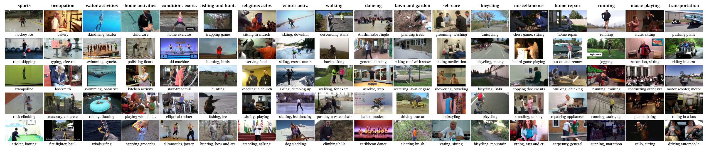
* Some [flickr](https://www.flickr.com/) archives. A curious mix of imagery.
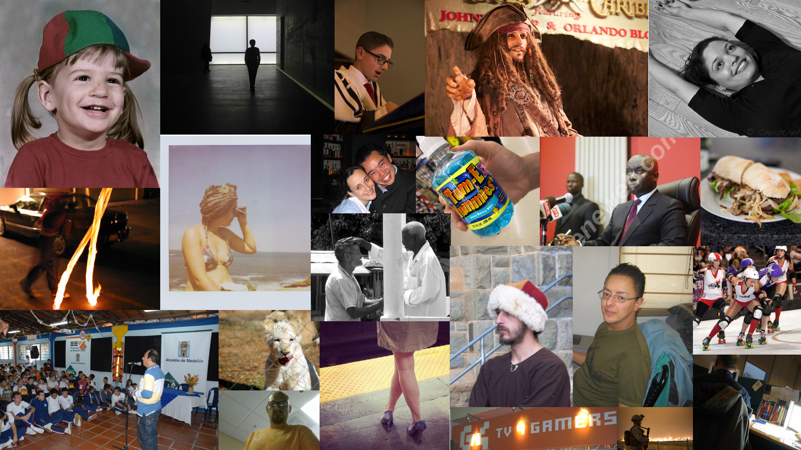
* The free and publicly-accessible [Rijksmuseum Archive](https://www.rijksmuseum.nl/en/search) which includes landscapes, portraits, paintings, sketches, cartoons and photographs (including photographs of sculptures).

* A large collection of manually curated pictures of apes, including hominids, which we included for a laugh, since occasionally you would be matched to one of these - especially if you struck monkey poses.
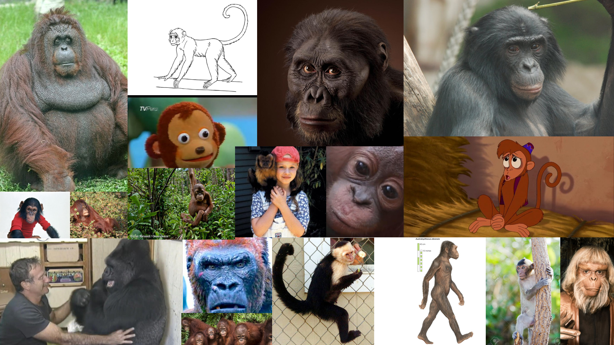

We wrote our own scraping tools, using NodeJS, to crawl index pages and generate lists of original images through links, then downloaded them all. In the end we had 696,897 images (about 614GB) to work with. Not Google-scale, obviously, but a significant challenge for a team of creative technologists and web developers.

Typically less than half of the Rijkmuseum archive images contained human poses (or at least, poses that could be detected by PoseNet), but their inclusion made the installation much richer visually than would have been the case if we had stuck with contemporary images only.

The PoseNet detection was impressive, and managed to infer human poses with incomplete information...

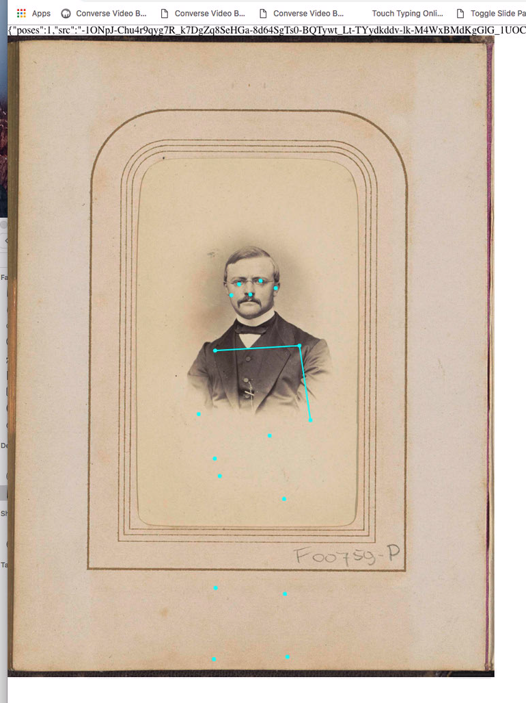

... and even within non-photographic representations such as line drawings:

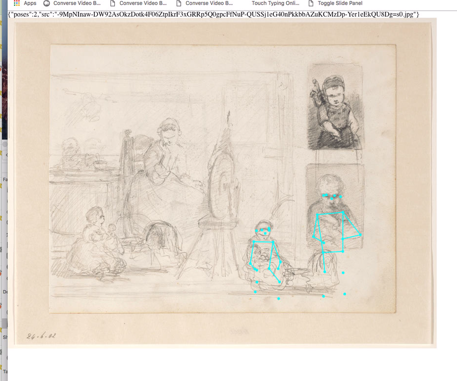

We could therefore find poses in a wide variety of styles:


### Processing and matching

To get all of this imagery and data into a usable form was one of the biggest challenges in this project. We designed (and refined) our own "data processing pipeline", illustrated below:

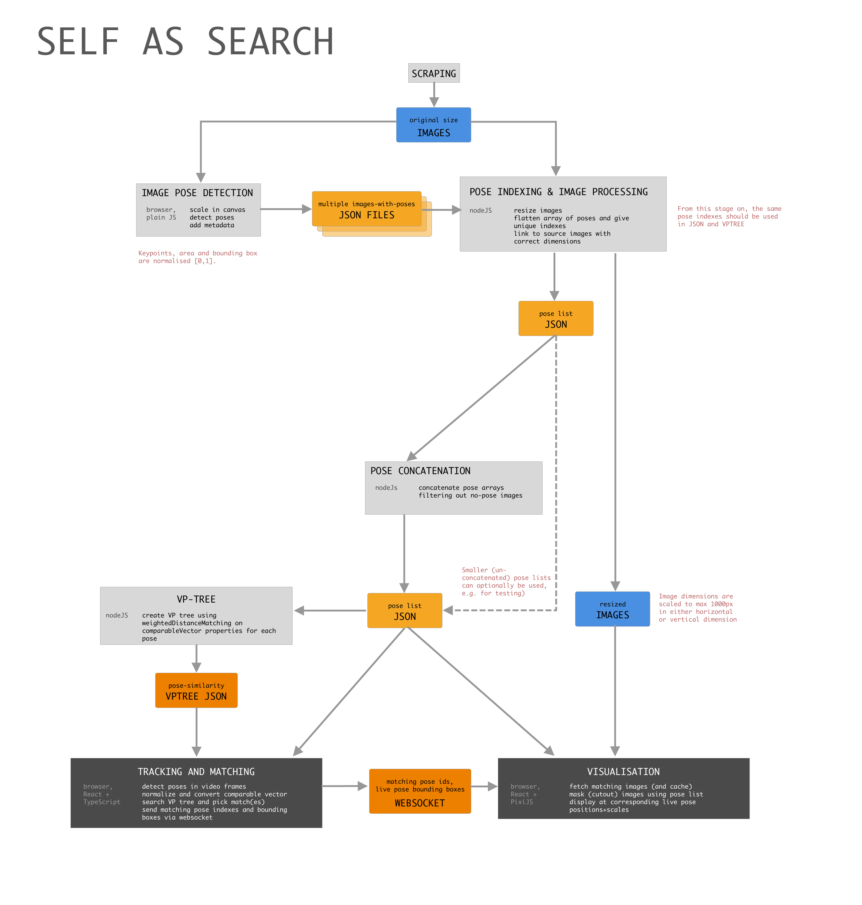

The pipeline was mostly a combination of command line tools written in NodeJS.

Apart from resizing, every image had to be loaded into the browser to run the PoseNet / Tensorflow pose detection - we possibly could have done this using NodeJS, but it was easier for us to actually see the results in the browser. Running the pose detection on a few thousand images could take many hours depending on the hardware; another reason that using web technology was beneficial was that it made the software extremely portable between different machines, so we could run these processes in parallel.

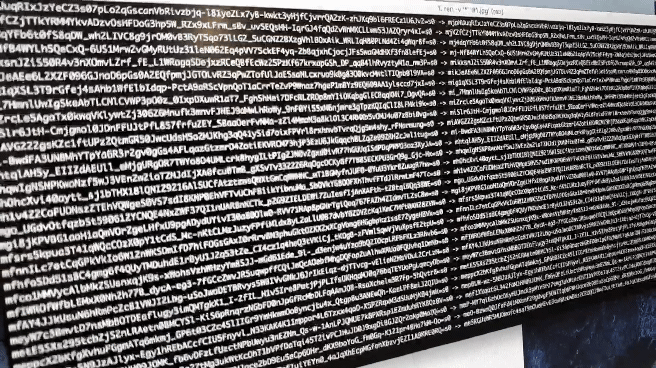

Now we had a bunch of massive JSON files (50-150MB each) containing references to the original image files and lists of body parts with positions. Here is a small excerpt of a single entry in a single file:
```
{
    "src": "000001163.jpg",
    "index": 0,
    "dimensions": [
        1000,
        562.5
    ],
    "poses": [
        {
            "index": 0,
            "poseNorm": {
                "score": 0.7557380725355709,
                "keypoints": [
                    {
                        "score": 0.9580614566802979,
                        "part": "nose",
                        "position": {
                            "x": 0.42552320626180173,
                            "y": 0.19028639878242465
                        }
                    },
                    // ... etc. etc. etc.
```

Next, we flattened the arrays of poses (listing poses with images, rather than images with poses), stripped out some whitespace and then concatenated these into even bigger JSON files, renumbering indexes as we went along. Our final version of this output was a 421MB JSON file with 148,833 objects in an array.

Finally, we had to build the Vantage Point Tree.

This was stretching NodeJS to some serious memory limits. Just to *load* the giant input array required a [streaming JSON parser](https://www.npmjs.com/package/stream-json) and to write out the file required another [streaming JSON library](https://www.npmjs.com/package/big-json) to output the huge object for the VP Tree.

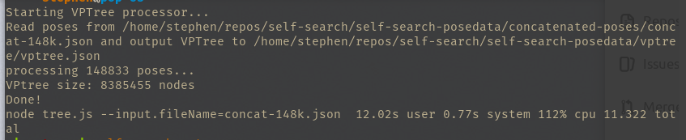

Our final VP Tree object contained over 8 million nodes. The contents looked something like this:

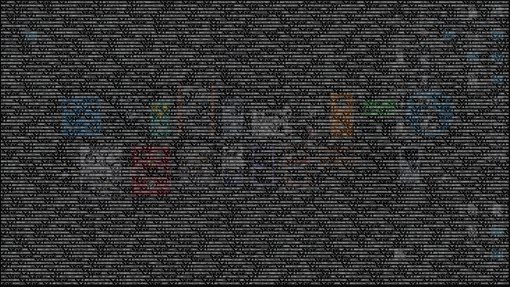

Along the way, we also had to "normalise" all the pose data, i.e. crop to the pose inside each image and put it inside a standard-sized "box" so that all poses could be comparable no matter where they appeared within their original images. Here, another strength of web development tooling was evident: we could easily share code using modules (npm modules) between multiple "front end" (browser-based) applications and various NodeJS command-line or server-side tools. That made it much simpler to standardise our processing of pose data in precisely the same way throughout the pipeline.

### Manually curating
All of the above automation was essential, but there was a problem: we had to filter content to be suitable for kids. Some examples were just ridiculous - this one from the Rijksmuseum collection:

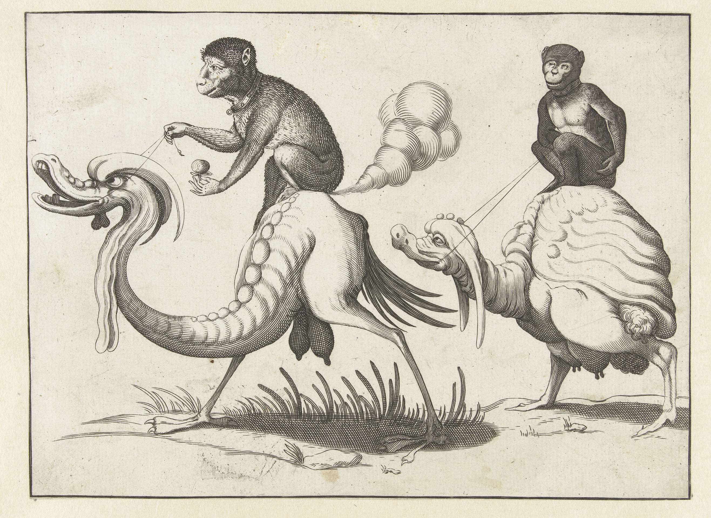

But of course we had to look for more serious issues: no images with nudity, violence or anything remotely disturbing. Historical photos sometimes portrayed racist imagery. Anatomical diagrams could present what looked like severed body parts. Some artists are fond of grotesque faces as subjects for portraiture. Medieval art is full of depictions of torture. And so on...

We couldn't risk having anybody accidentally land on something horrible by mistake. Since we do not have the resources of Google or Facebook, using an automated process was out of the question.

Our poor interns.

### Displaying
From a User Experience design perspective, this installation presented an interesting challenge of how to present the results of "matches" on screen (at a large scale) in a way that was both aesthetically interesting but also allowed the users (kids, remember) to understand what was happening, and what they needed to *do*.

Since we were picking poses out of images with multiple visible human bodies, we would need to crop in to the original image. This presented some interesting opportunities.

At first, we tried simply "joining the dots" and roughly cutting out the edges of the "skeleton". The results were curious:

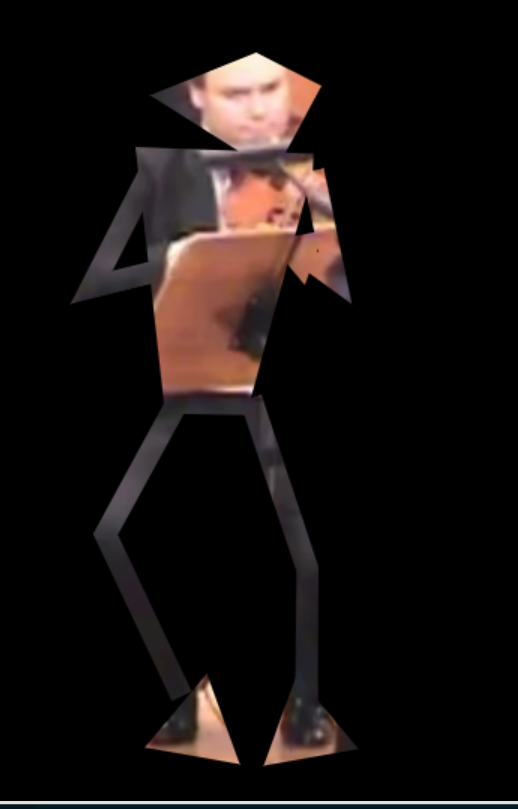

We also tried cutting out using bigger triangular shapes:

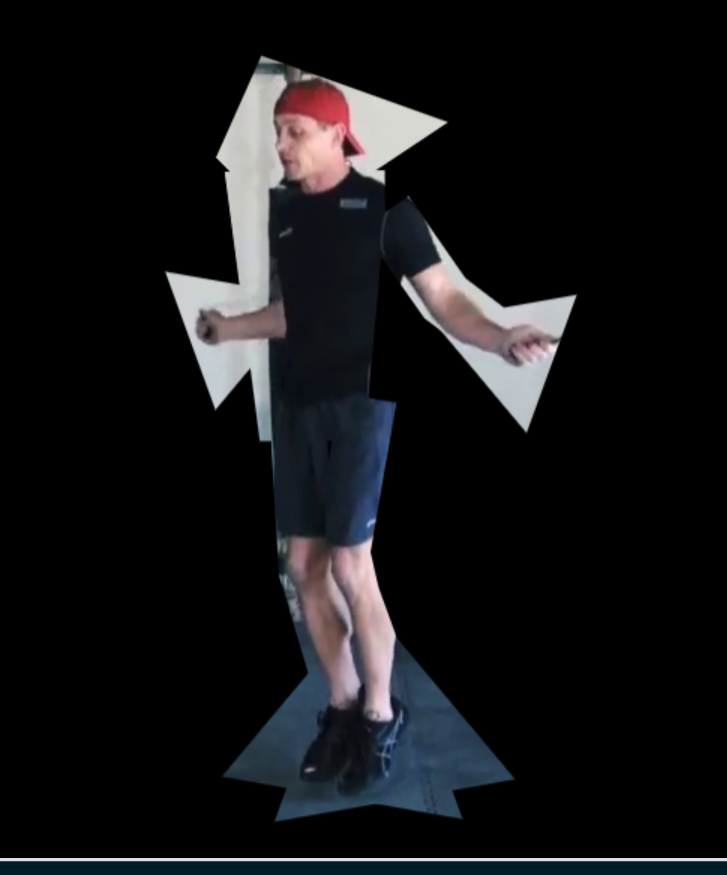

And got more creative, joining all identified body points to all other points in a kind of mesh:

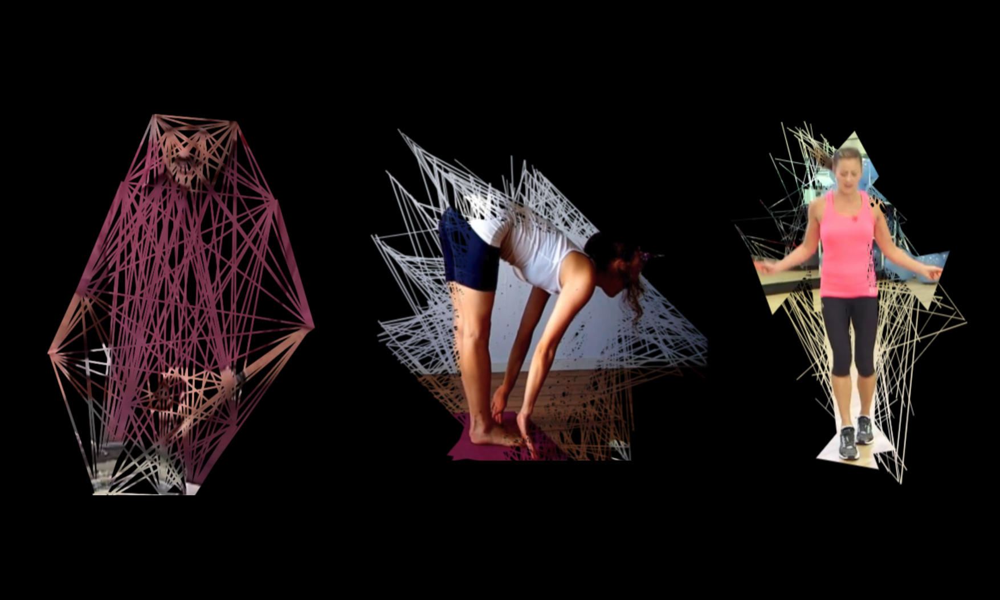

Some of these results were interesting, but occasionally too abstract. And when images changed fast (a few times a second) then it became confusing. We settled on using a rectangular crop instead.


We also overlaid a simple line drawing of the *user's* skeleton, as detected via the camera, and made sure to align and scale this to fit over the corresponding pose in the matched image. This technique ultimately helped to make a strong connection between your own body's pose and the matched poses from the images.

Finally, we displayed rapidly-updating rows of the 10 closest matches per person along the top of the screen (otherwise unused space with a projection surface that was a few metres tall). This was real data, not mocked up, and reinforced the appreciation of how much work the computer was doing - and how quickly - to produce all of these results on screen.

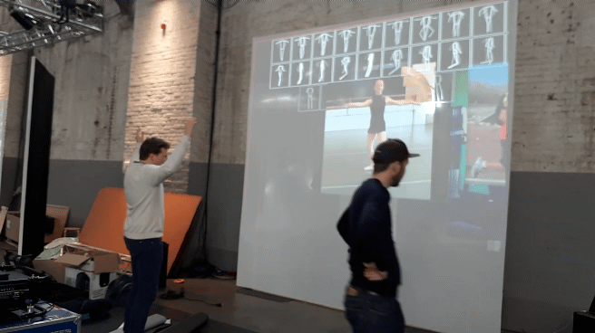

The output was drawn in the browser, of course, and we used the [PixiJS library](https://www.pixijs.com/) extensively to provide high performance GPU-accelerated drawing and 2D special effects (for example, the trailing effect).

## Live hardware and software
To make sure we squeezed maximum performance out of the tracking-and-matching application, we split the "live" installation system over two Linux PC's. Another advantage of web technology: developing on one platform (mostly Mac OS) and deploying on another (Ubuntu Linux) was painless, since NodeJS and Chrome provide identical environments in a sandbox regardless of Operating System.

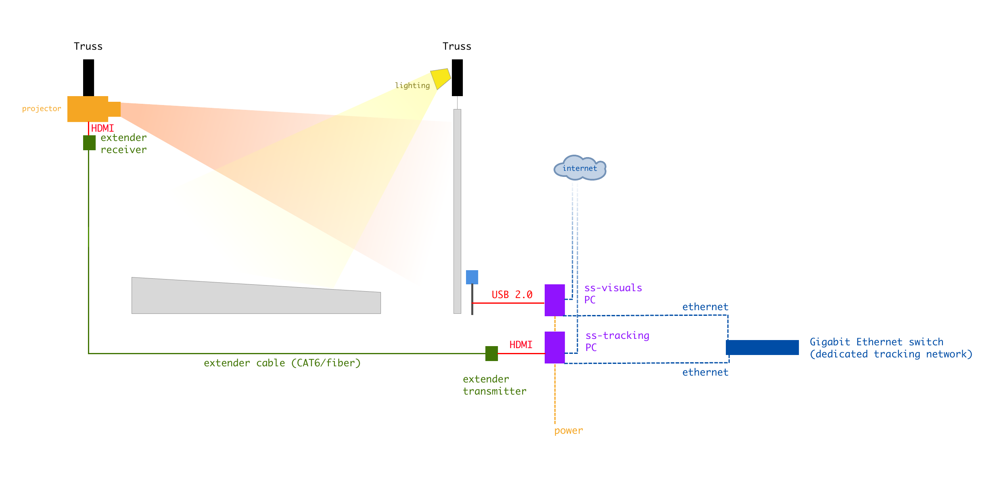

One PC ran only the tracking/matching on the webcam feed. This was a [React](https://reactjs.org/) app to provide a useful GUI while configuring and debugging.

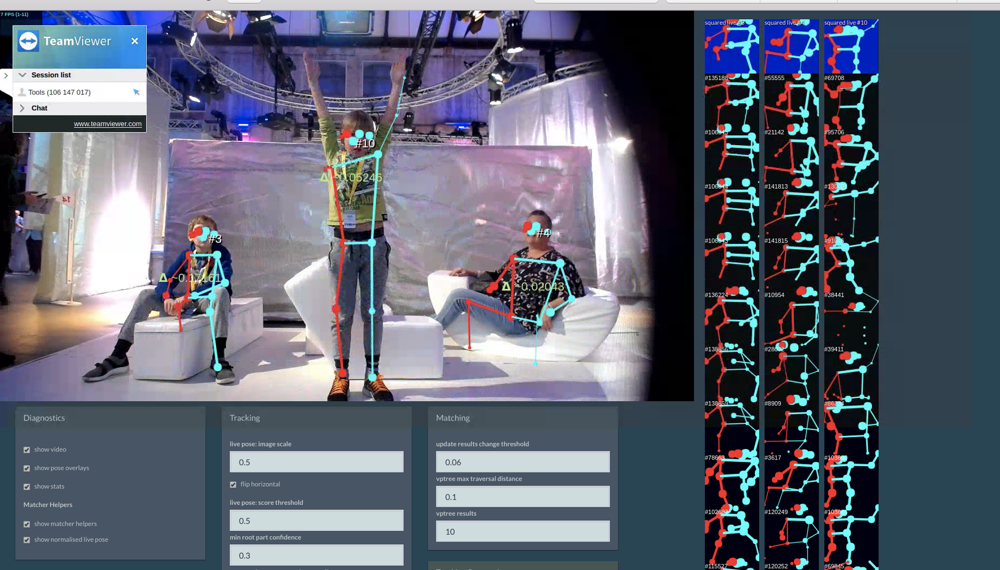

As an interesting aside, we experimented with using [TypeScript](https://www.typescriptlang.org/) with React (not a common combination, but certainly well [supported](https://facebook.github.io/create-react-app/docs/adding-typescript)). It proved invaluable in this project, since precision with data and algorithms was essential, and TypeScript [helped us](https://dzone.com/articles/what-is-typescript-and-why-use-it) to proactively manage the complexity of the software.

## Summary

The key lessons we drew from this experience:

1. AI, or Machine Learning in particular, can be used by non-experts for a variety of creative applications, provided some time is invested in researching the appropriate tools, pretrained models, etc.
1. Machine Learning for tasks such as body tracking is a viable replacement for specialised hardware such as depth cameras.
1. Large datasets may require designing custom workflows and automated tooling in order to manage effectively. This needs to be factored into development time.
1. "Web technologies" (modern browsers, NodeJS, web application frameworks) provide a viable development toolkit for using Machine Learning technology. This situation is likely to improve as web graphics and General-Purpose GPU web technologies mature (see [WebGPU](https://medium.com/@babylonjs/webgpu-is-coming-to-babylon-js-c44f8065ac05) for example).
1. While web technologies have drawbacks (mostly in terms of performance), the advantages are numerous:
    1. Teams can draw on existing web development skills, which practically means *there are more people to help with the project*
    1. GUI controls are easier to implement
    1. Module systems in Javascript are mature, so incorporating third-party code or sharing internal code is much easier than in many other environments (particularly C++)
    1. Data is much easier to handle, transform and generate using formats such as JSON
    1. What you might lose in raw performance, you gain in being able to rapidly experiment, prototype, iterate and get things done

